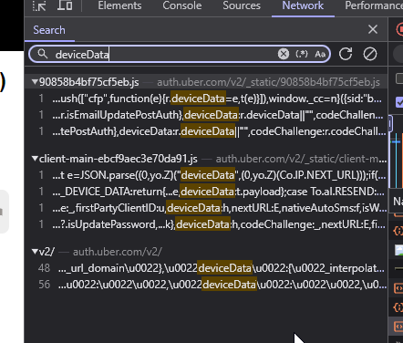
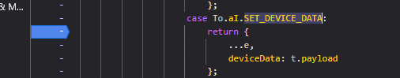
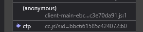
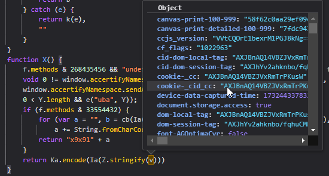
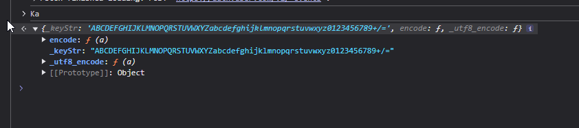
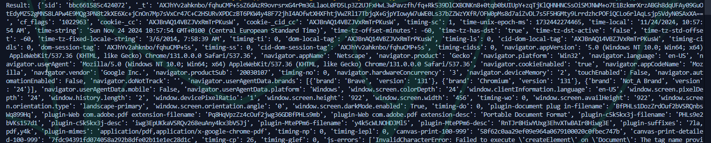
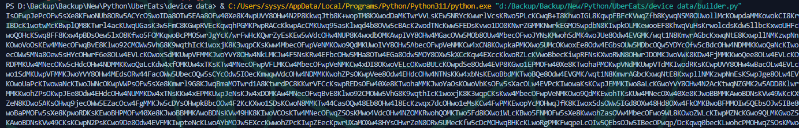

<div align="center">
  <h1 align="center">UberEats devicedata reverse</h1>
  <p align="center">
    A simple reverse made for a project, could help people.
    <br />
    <br />
    <a href="https://t.me/askineiko">💬 Telegram</a>
    ·
    <a href="https://github.com/Askin242/ubereats-device-data/issues/new">⚠️ Report Bug</a>
    ·
    <a href="https://github.com/Askin242/ubereats-device-data/issues/new">💡 Request Feature</a>
  </p>
</div>
<p align="center">
  
  
  
</p>

---

### 🎁 What's in

- Encryption/Decryption
- Fingerprint generation
- Full explaination


---

### ⚙️ How do i managed to make this ?

Everything start when a customer want me to work with UberEats. When looking at the requests I find a strange value, deviceData. It seem to be base64 encoded but when decoding it, it give invalid data. So let's investigate :)

I start by looking at every reference for deviceData.



I decide to go into the client-main file as it have a SET_DEVICE_DATA event.


Let's add a breakpoint and go backward to understand how the `t.payload` field is made.

After some investigation, i found that our value disappear when going from the anonymous function to the cfp one.



The cfp function call the anonymous using `a(X())` which mean that our payload is built using the `X` function.

```javascript
function X() {
    f.methods & 268435456 && "undefined" !== typeof Storage ? Ja(localStorage) : f.methods & 536870912 && "undefined" !== typeof Storage ? Ja(sessionStorage) : 0 < Object.keys(r.bfd).length && e("bfd", r.bfd);
    void 0 != window.accertifyNamespace && (window.accertifyNamespace.sendPtno(),
    window.accertifyNamespace.sendAll(),
    0 < Y.length && e("uba", Y));
    if (f.methods & 33554432) {
        for (var a = "", b = cb(Ia(unescape(encodeURIComponent(Z.stringify(v))))), c = 0; c < b.length; c++)
            a += String.fromCharCode(b[c]);
        return "x9x91" + a
    }
    return Ka.encode(Ia(Z.stringify(v)))
}
```

The first thing that I see in this function is the `return Ka.encode(Ia(Z.stringify(v)))`, mainly `Z.stringify(v)` wich is verry likely to return a json of the decrypted payload.



Yep, we got our fully decrypted payload, so let's take a look at how it's encrypted.

`Ka.encode` seems to be a base64 encode implementation, that confirm my first thought of the payload to be base64 encoded.

```javascript
var Ka = {
    _keyStr: "ABCDEFGHIJKLMNOPQRSTUVWXYZabcdefghijklmnopqrstuvwxyz0123456789+/\x3d",
    encode: function(a) {
        var b = "", c, d, e, f, k, m, l = 0;
        for (a = Ka._utf8_encode(a); l < a.length; )
            c = a.charCodeAt(l++),
            d = a.charCodeAt(l++),
            e = a.charCodeAt(l++),
            f = c >> 2,
            c = (c & 3) << 4 | d >> 4,
            k = (d & 15) << 2 | e >> 6,
            m = e & 63,
            isNaN(d) ? k = m = 64 : isNaN(e) && (m = 64),
            b = b + this._keyStr.charAt(f) + this._keyStr.charAt(c) + this._keyStr.charAt(k) + this._keyStr.charAt(m);
        return b
    },
    _utf8_encode: function(a) {
        for (var b = "", c = 0; c < a.length; c++) {
            var d = a.charCodeAt(c);
            128 > d ? b += String.fromCharCode(d) : (127 < d && 2048 > d ? b += String.fromCharCode(d >> 6 | 192) : (b += String.fromCharCode(d >> 12 | 224),
            b += String.fromCharCode(d >> 6 & 63 | 128)),
            b += String.fromCharCode(d & 63 | 128))
        }
        return b
    }
}
```

So the only function left, the one that should encrypt everthing, is `Ia`. 
```javascript
function Ia(a) {
    try {
        for (var b = "", c = [89, 231, 225, 55], d = 0; d < a.length; d++)
            b += String.fromCharCode(a.charCodeAt(d) ^ c[d % c.length]);
        return b
    } catch (e) {
        return k(e),
        ""
    }
}
```
This code implements a simple encryption based on an XOR (exclusive logical OR operation) with a key `[89, 231, 225, 55]`

Let's translate our code to python see `decrypt.py`:
```python
import base64
import json

def decrypt_data(encoded_data, key):
    base64_decoded = base64.b64decode(encoded_data).decode('utf-8')

    key_length = len(key)
    decrypted_chars = [
        chr(ord(char) ^ key[i % key_length]) 
        for i, char in enumerate(base64_decoded)
    ]
    decrypted_str = ''.join(decrypted_chars)

    return json.loads(decrypted_str)

xor_key = [89, 231, 225, 55]

encoded_data = "IsOFwpJePcOFw..."

decrypted_data = decrypt_data(encoded_data, xor_key)
print("Result: ", decrypted_data)
```

And by just running it we get our full payload!


Simple encryption code (similar as decryption one), `encrypt.py`:
```python
import base64
import json

def encrypt_data(data, key):
    json_str = json.dumps(data)
    
    key_length = len(key)
    encrypted_chars = [
        chr(ord(char) ^ key[i % key_length]) 
        for i, char in enumerate(json_str)
    ]
    xor_encrypted = ''.join(encrypted_chars)
    
    return base64.b64encode(xor_encrypted.encode('utf-8')).decode('utf-8')

xor_key = [89, 231, 225, 55]

data = {'sid': 'bbc661585c424072'}

encrypted_data = encrypt_data(data, xor_key)
print("Result:", encrypted_data)
```

Now let's build our own device data. First we need to find what to change.

_"From html" mean from `https://auth.uber.com/v2/_static/90858b4bf75cf5eb.js`_

- `sid`: from html
- `_t`:  value from cc.js (`N = "<_t>"`)
- `cf_flags`: from cc.js 
- `cookie-_cc`: cookie
- `cookie-_cid_cc`: cookie
- `time-unix-epoch-ms`: time
- `time-local`: time
- `time-string`: time
- `dom-local-tag`: cookie
- `cid-dom-local-tag`: cookie
- `dom-session-tag`: cookie
- `cid-dom-session-tag`: cookie
- `canvas-print-100-999`: maybe to randomize ?
- `canvas-print-detailed-100-999`: maybe to randomize ?
- `js-errors`: replace clsid to value from cc.js
- `webgl-vendor-real`: randomize
- `webgl-renderer-real`: randomize
- `ccjs_version`: from cc.js 
- `script-load-time`: Date.now()
- `device-data-captured-time`: Date.now()

I wrote a simple script that extract/get all data for everything except canvas. For the canvas we'll try to make it random, and hope they are not checking it correctly.

We could also get real users fingerprint by making a custom website using this code:
```javascript
function Ab() {
    for (var a = [100], b = 0; b < a.length; b++) {
        var c = "AaBbCcDdEeFfGgHhIiJjKkLlMmNnOoPpQqRrSsTtUuVvWwXxYyZz0123456789"
          , d = a[b]
          , h = document.createElement("canvas");
        if (h && (nc(c),
        h.getContext)) {
            var g = h.getContext("2d");
            g && (h.width = 999,
            g.font = d + "pt Arial",
            g.textBaseline = "top",
            g.fillText(c, 2, 2),
            h.toDataURL(),
            c = y.algo.SHA1.create(),
            c.update(h.toDataURL().toString()),
            e("canvas-print-" + d + "-999", c.finalize().toString(y.enc.Hex)),
            g.clearRect(0, 0, h.width, h.height),
            g.fillStyle = "#00ffe6",
            g.fillRect(125, 20, 333, d),
            g.fillStyle = "#00b3a1",
            g.fillText(c, 2, 15),
            g.fillStyle = "rgba(0, 119, 138, 0.69)",
            g.fillText(c, 10, 25),
            c = y.algo.SHA1.create(),
            c.update(h.toDataURL().toString()),
            e("canvas-print-detailed-" + d + "-999", c.finalize().toString(y.enc.Hex)))
        }
    }
}
```

But from this code the value is hashed using sha1, so let's just hash random value.

The builder is finished, let's run it, and boom it work :)


That's it, we finished reversing the `deviceData` field from UberEats API, I hope it helped you.

Have a nice day :)
